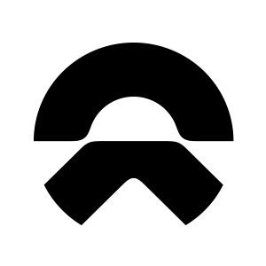

**Hi there** 🧑🏻‍💻 

🏫 There is a student @[WHUT](http://www.whut.edu.cn).Major in Fintech. 

🎈 I'm CaiZhi Feng, you can call me Ryker FENG Or 阳树. 

👨‍💻 Working hard to be an excellent Frontend Developer~

📫 QQ: 2279549769 WeChart: 18062706139

## 🌏 Languages

| Mastered                                                     | Studying                                                     |
| ------------------------------------------------------------ | ------------------------------------------------------------ |
|     |           |

## Some Intern Experiences

<tr>
<td>

- [美团](https://home.meituan.com/) &emsp; 📌 2023-06 —— Now

  - Job position: System development intern
  - Work Department: Dvertising position closing team of the marketing department
  - Work direction: Development iterations and performance tuning of B2B systems (big data direction)
    </td>
    </tr>
  

    <tr>
    <td>

- [Nio](https://www.nio.cn/) &emsp; 📌 2022-12 —— 2023-06

  - Job position: Front-end intern
  - Work Department: Autonomous Driving Operations
  - Work direction: ADass operation backend, NIO APP

</td>
</tr>

## My Personal Blog & Knowledge Base

+ [Ryker-](https://www.rykerfeng.cn) A Chinese website for sharing life and experiences

+ [MyFirstBlog](https://18062706139fcz.github.io/index.html) Using html,css,and little javascript.

+ [interview](https://www.yuque.com/books/share/68dc5e98-568a-46a8-8fd6-65dd0e84efec?) A knowledge base for recording learning and growth

+ [Fronted Base](https://18062706139fcz.github.io/learn-javas/handbook/start.html) Front end knowledge base no longer maintained

## 🔭 Overview

<table>
  <tr>
    <td></td>
    <td></td>
  </tr>
</table>

------------

<strong>We will become friends right?</strong>

------------
